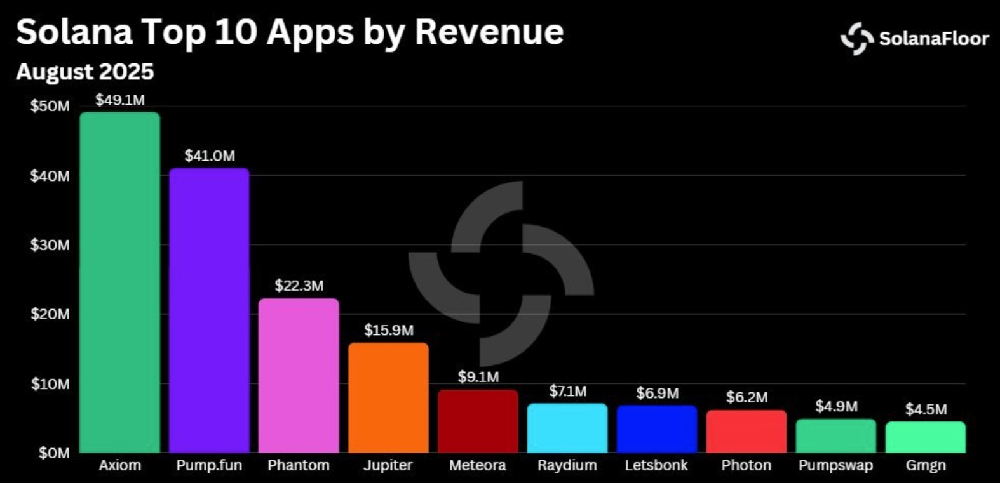

# Axiom-Trade-Backend
This is backend repository for axiom.trade fork. It is not completed yet, ongoing project. Currently it is supporting tokens from Raydium and Pumpfun, but will be expanded to all dexs. Interacting with Raydium (AMM) and pumpfun smart contract, it is fetching token information from them, and socketing to UI side. 
Also there is one more staging version, that is using api of other platforms. 

